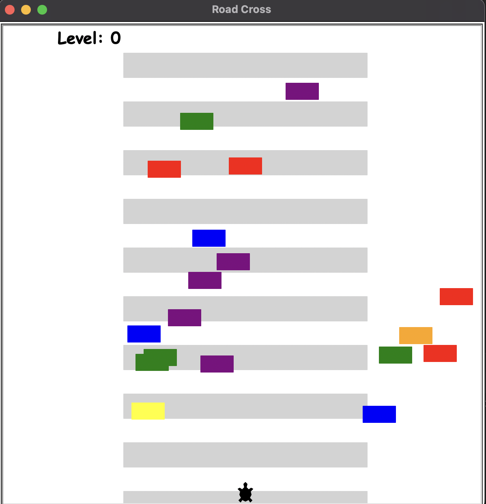
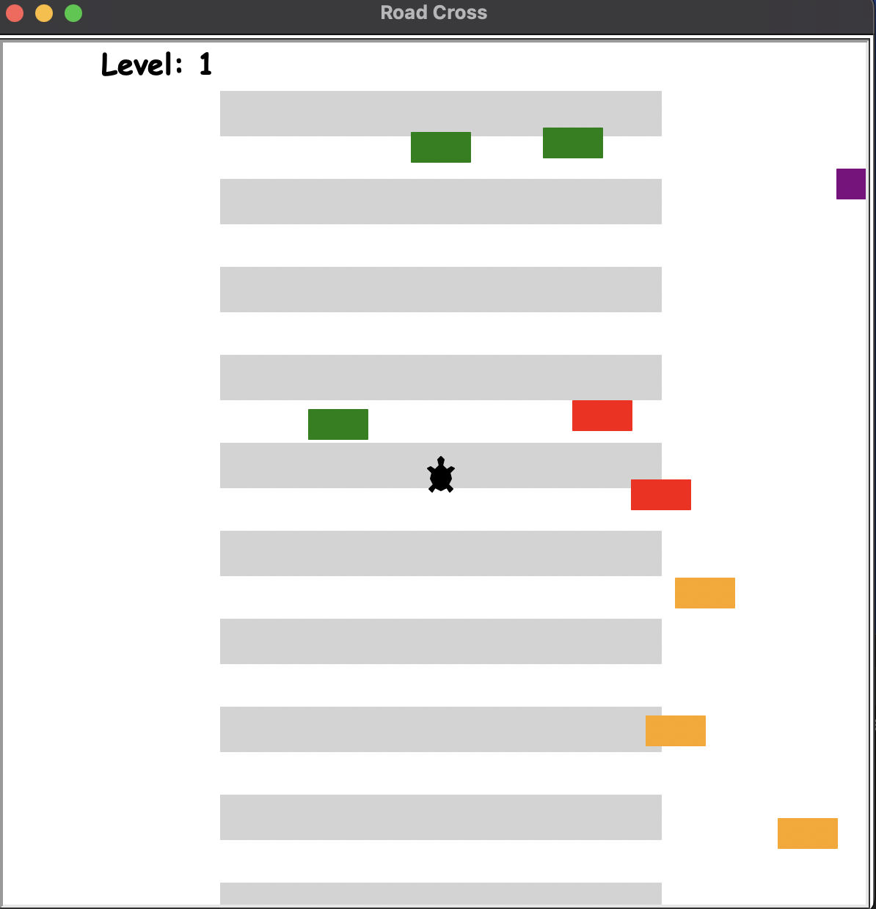
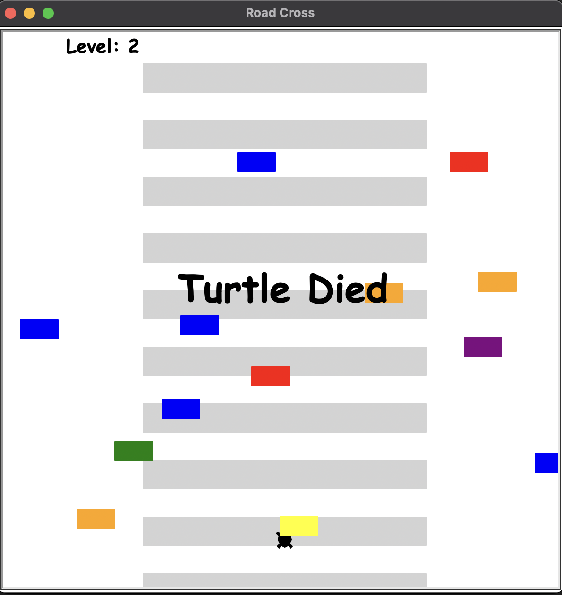

# 🐢 Turtle Road Crossing Game

🎮 A keyboard-controlled Turtle Road Crossing Game built with Python's Turtle module — featuring a checkered road with dark gray borders, colorful moving cars, level progression, and collision detection for an exciting arcade-style experience.

---

## 🖼️ Examples

Here are screenshots of the game in action:

 Game Start
 Game Middle
 Game End

---

## 🎯 Features

- Control a black turtle to cross a busy road  
- Randomly spawning colorful cars with increasing speed per level  
- Checkered road with light gray blocks and dark gray borders at top and bottom  
- Scoreboard displaying current level and "Turtle Died" on collision  
- Smooth gameplay with collision detection and level progression  

---

## 🎮 Controls

| Key  | Action                               |
|-------|-------------------------------------|
| Up    | Move turtle up by 10 pixels        |
| Down  | Move turtle down by 10 pixels      |

---

## ▶️ Running the Program

Make sure you have Python 3.6+ installed, then run:

```bash
cd TurtleRoadCrossing
python main.py
```

---

## 📁 File Structure

The project directory structure:

```
TurtleRoadCrossing/
├── main.py
├── road_drawing.py
├── car_manager.py
├── player.py
├── scoreboard.py
├── 1.png
├── 2.png
├── 3.png
```

---

## 🧠 How It Works

- Utilizes Python's turtle module — no external libraries required  
- `RoadDrawer` creates a checkered road with light gray blocks (30px tall, 300px wide) and dark gray borders (20px tall, 600px wide) positioned at y=280 and y=-280  
- `CarManager` spawns cars randomly with a 1/6 chance per frame, moving left with increasing speed each level  
- `Player` controls a black turtle, moving up/down within screen bounds  
- `Scoreboard` tracks levels and displays "Turtle Died" message upon collision  
- The game loop updates every 0.1 seconds, handling collisions and level progression  

---

## 📚 Acknowledgements

This project was inspired by core game mechanics outlined in a Python programming course. While the basic concept and requirements were provided by the course, I independently implemented the game, adding custom features like the checkered light gray road blocks and dark gray borders to enhance visuals and gameplay.

---

## 💡 Tips for Expansion

- Add sound effects for collisions or level-ups  
- Introduce different car types with varying speeds  
- Add obstacles or power-ups on the road  
- Implement a high-score system  
- Customize the turtle’s appearance with user-selected colors  

---

## 📄 License

This project is licensed under the MIT License — free to use, modify, and share.

---

**Happy crossing! 🐢🚗**
